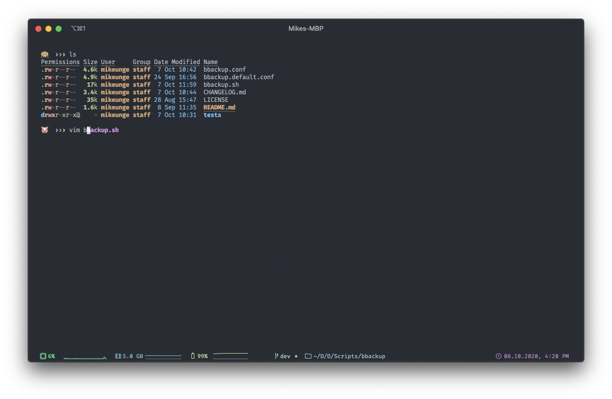
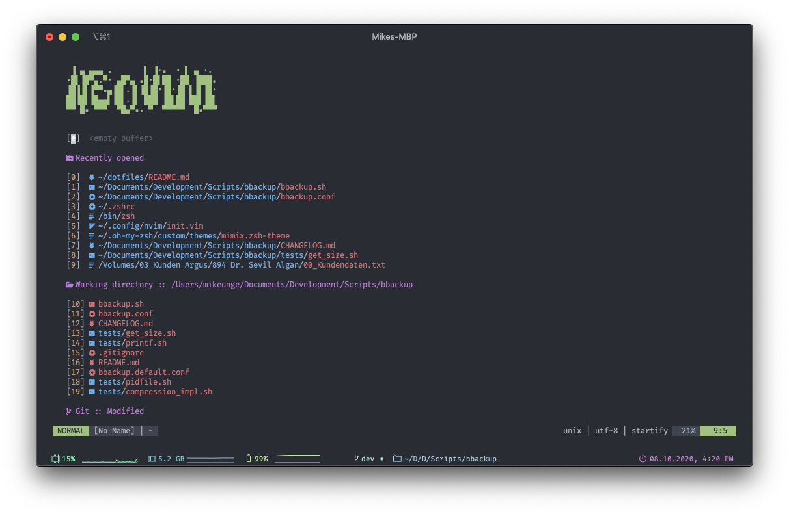
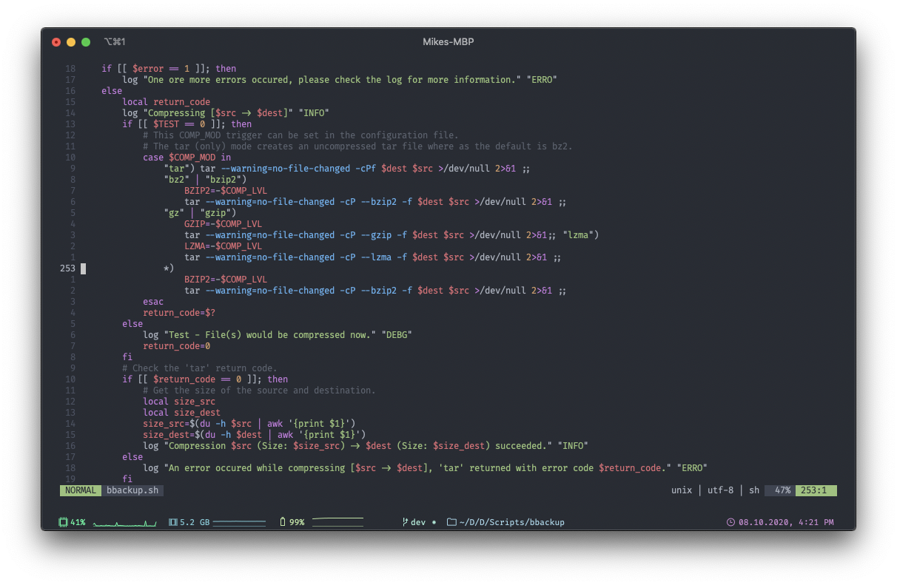

# ☁ dotfiles

### About
> My `MacOS` dotfiles.

I use `iTerm2` as my terminal emulator of choice.
It has been heavily modified but I love the look and feel of the terminal so far.

*Will most likely tweak it here and there, but yeah, that's my fate...*

### Screenshots
> Some screenshots of how it looks and feels.

#### _terminal

#### _vim

#### _code

